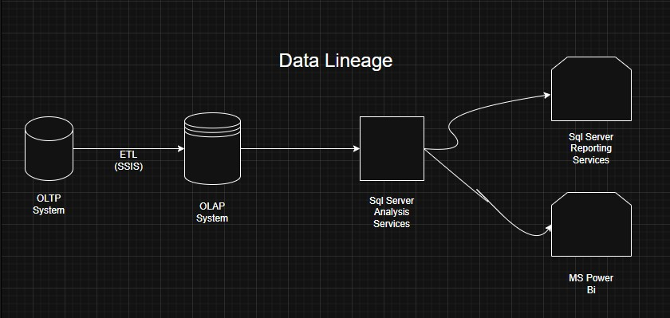
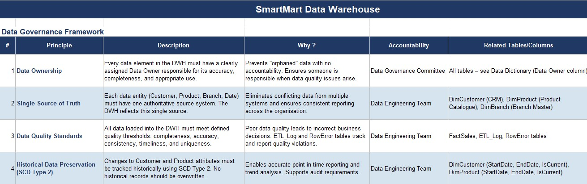
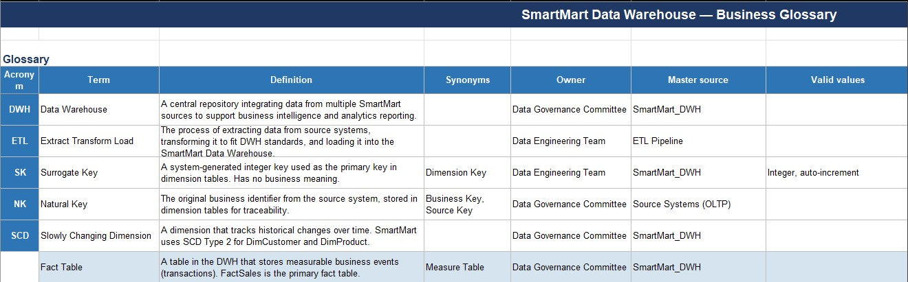
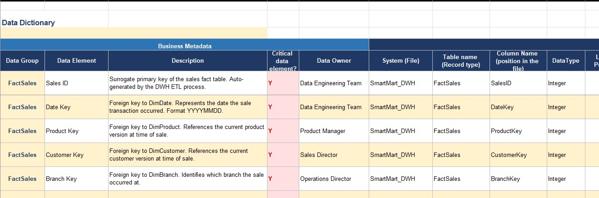

<div align="center">


# 🛒💡 SmartMart Data Intelligence & Governance Hub

**A Banking-Ready Data Governance Framework for the SmartMart Data Warehouse**

[](https://www.linkedin.com/in/mahmoud-mamdouh-324125220/)
[](#)
[](#)
[](#)
[](#)

---

[📋 Overview](#-overview) · [🏗️ Architecture](#️-architecture) · [📁 Repository Structure](#-repository-structure) · [📄 Document Contents](#-document-contents) · [🔗 Data Lineage](#-data-lineage) · [🛡️ Governance Principles](#️-governance-principles) · [📬 Contact](#-contact)

</div>

---

## 📋 Overview

This repository is the official **Data Governance artifact** for the **SmartMart Data Warehouse (DWH)** project. It documents the full governance framework applied to a retail analytics data warehouse built on a **star schema** architecture using **SQL Server**.

The deliverable — `Final_Version_SmartMart_DWH_DataGovernance.xlsx` — is designed to meet **Banking-Ready standards**, incorporating regulatory metadata layers including Data Classification, PII flagging, Data Masking rules, and Data Lineage transparency.

> **What problem does this solve?**  
> Without governance, data warehouses become ungovernable over time — conflicting definitions, no accountability, undocumented transformations, and compliance risk. This framework ensures every data element in SmartMart's DWH has a clear owner, definition, lineage, and classification.

---

## 🏗️ Architecture

SmartMart's DWH follows a **classic star schema** pattern:

```
                    ┌─────────────┐
                    │   DimDate   │
                    └──────┬──────┘
                           │
┌──────────────┐    ┌──────┴──────┐    ┌───────────────┐
│  DimCustomer │────│  FactSales  │────│   DimProduct  │
└──────────────┘    └──────┬──────┘    └───────────────┘
                           │
                    ┌──────┴──────┐
                    │  DimBranch  │
                    └─────────────┘
```

| Layer | Technology | Description |
|-------|-----------|-------------|
| **Source (OLTP)** | SQL Server | Transactional POS, CRM, ERP, Branch Master systems |
| **ETL** | SSIS | Extract, Transform, Load pipeline with nightly batch jobs |
| **DWH (OLAP)** | SQL Server | Star schema — 1 Fact table, 4 Dimension tables |
| **Analytics** | SSAS | SQL Server Analysis Services — semantic layer |
| **Reporting** | SSRS / Power BI | Final dashboards and operational reports |

---

## 📁 Repository Structure

```
SmartMart-DWH-Governance-Framework/
│
├── 📊 Final_Version_SmartMart_DWH_DataGovernance.xlsx   # Main governance document
│
├── 🗄️ SmartMart_DWH.bak                                 # SQL Server DWH backup
│
├── 🖼️ Data_Lineagell.jpg                                 # Data Lineage diagram
│
├── 📁 Project_Screens/                                   # Sheet screenshots
│   ├── Data_Dictionary_Sheet.jpg                         # Data Dictionary view
│   ├── Data_Governance_Sheet.jpg                         # Governance principles view
│   ├── Glossary_Sheet.jpg                                # Business glossary view
│   └── init_file
│
└── 📖 README.md                                          # This file
```

---

## 📄 Document Contents

The Excel file (`Final_Version_SmartMart_DWH_DataGovernance.xlsx`) contains **4 sheets**:

### 🎨 Cover Sheet
Professional document ownership page including author details, version, classification, and project description.

### 🛡️ Data Governance Sheet
14 governance principles organised into a structured framework.

### 📖 Glossary Sheet
Business glossary covering all SmartMart DWH terminology with:
- Business definitions & synonyms
- Data owners & master sources
- Valid values & calculation logic

### 📐 Data Dictionary Sheet
Full technical + business metadata for all **5 DWH tables** (44 columns documented) with **15 metadata attributes** per column:

| # | Metadata Attribute | Description |
|---|-------------------|-------------|
| 1 | Data Group | Table name (FactSales, DimDate, etc.) |
| 2 | Data Element | Business-friendly column name |
| 3 | Description | Full business definition |
| 4 | **Critical Data Element (CDE)** | Y = priority monitoring required |
| 5 | Data Owner | Accountable business role |
| 6 | System (File) | Source system |
| 7 | Table Name | Physical DWH table |
| 8 | Column Name | Physical column name |
| 9 | DataType | Integer, Varchar, Decimal, Date, Boolean |
| 10 | Length / Precision | Size constraints |
| 11 | Format / Valid Values | Allowed values or format |
| 12 | Constraints | PK, FK, NOT NULL, etc. |
| 13 | **Data Classification** | Public / Internal / Confidential / Highly Confidential |
| 14 | **PII Flag** | Yes / No — personal data identifier |
| 15 | **Data Masking Rule** | How sensitive data is obscured in non-prod |

#### Tables Covered

| Table | Type | Rows Documented | SCD Type |
|-------|------|----------------|----------|
| `FactSales` | Fact | 12 columns | — |
| `DimDate` | Dimension | 8 columns | Static |
| `DimProduct` | Dimension | 9 columns | **SCD Type 2** |
| `DimCustomer` | Dimension | 8 columns | **SCD Type 2** |
| `DimBranch` | Dimension | 5 columns | Static |

---

## 🔗 Data Lineage

The diagram below illustrates the end-to-end data flow from source systems to final reporting tools:



```
OLTP System  ──ETL (SSIS)──►  OLAP System  ──►  SQL Server Analysis Services
                                                        │
                                          ┌─────────────┴──────────────┐
                                          ▼                            ▼
                               SQL Server Reporting              MS Power BI
                                  Services (SSRS)
```

**Lineage is enforced in the DWH via:**
- `FactSales.SourceName` — tracks originating source system per row
- Natural Keys (`CustomerCode`, `ProductCode`, `BranchCode`) — trace back to OLTP
- `ETL_Log` table — records every pipeline run with timestamps and row counts
- `InsertedAt` column — row-level load timestamp in FactSales

---

## 🛡️ Governance Principles

14 principles organised across 5 governance domains:

<details>
<summary><strong>📌 Accountability & Ownership (3 principles)</strong></summary>

| # | Principle | Summary |
|---|-----------|---------|
| 1 | **Data Ownership** | Every data element has an assigned Data Owner |
| 6 | **Critical Data Elements (CDEs)** | Priority monitoring for business-critical columns |
| 14 | **Data Stewardship** | Every table has a business-side Data Steward (not just a Data Engineer) |

</details>

<details>
<summary><strong>📌 Data Quality & Integrity (3 principles)</strong></summary>

| # | Principle | Summary |
|---|-----------|---------|
| 2 | **Single Source of Truth** | One authoritative source per entity |
| 3 | **Data Quality Standards** | Completeness, accuracy, consistency, timeliness, uniqueness |
| 8 | **Referential Integrity** | All FK relationships enforced in FactSales |

</details>

<details>
<summary><strong>📌 History & Traceability (3 principles)</strong></summary>

| # | Principle | Summary |
|---|-----------|---------|
| 4 | **Historical Data Preservation (SCD Type 2)** | Customer & Product changes tracked historically |
| 5 | **Data Lineage & Traceability** | Every record traceable to its source |
| 13 | **Data Lineage Transparency** | All values in reports must be traceable end-to-end |

</details>

<details>
<summary><strong>📌 Security & Compliance (3 principles)</strong></summary>

| # | Principle | Summary |
|---|-----------|---------|
| 7 | **Data Access Control** | Role-based permissions; PII columns restricted |
| 11 | **No Direct DWH Modifications** | All changes must flow through ETL |
| 12 | **Data Retention Policy** | 7-year minimum retention for FactSales |

</details>

<details>
<summary><strong>📌 Standards & Operations (2 principles)</strong></summary>

| # | Principle | Summary |
|---|-----------|---------|
| 9 | **Standardised Naming Conventions** | Dim*, Fact*, *Key, *Code, IX_* conventions enforced |
| 10 | **ETL Auditability** | Every ETL run logged; InsertedAt tracked per record |

</details>

---

## 🖼️ Project Screenshots

<table>
  <tr>
    <td align="center"><strong>Data Governance Sheet</strong></td>
    <td align="center"><strong>Glossary Sheet</strong></td>
    <td align="center"><strong>Data Dictionary Sheet</strong></td>
  </tr>
  <tr>
    <td></td>
    <td></td>
    <td></td>
  </tr>
</table>

---

## 📬 Contact

<div align="center">

**Mahmoud Mamdouh**  
*Data & Analytics Engineer*

[](https://www.linkedin.com/in/mahmoud-mamdouh-324125220/)
[](https://github.com/Mahmooo0od)
[](mailto:mamdouhmahmoud53@gmail.com)

</div>

---

<div align="center">

© 2026 Mahmoud Mamdouh · SmartMart Data Intelligence & Governance Hub · All Rights Reserved

*Built with ❤️ and governed with intention.*

</div>
